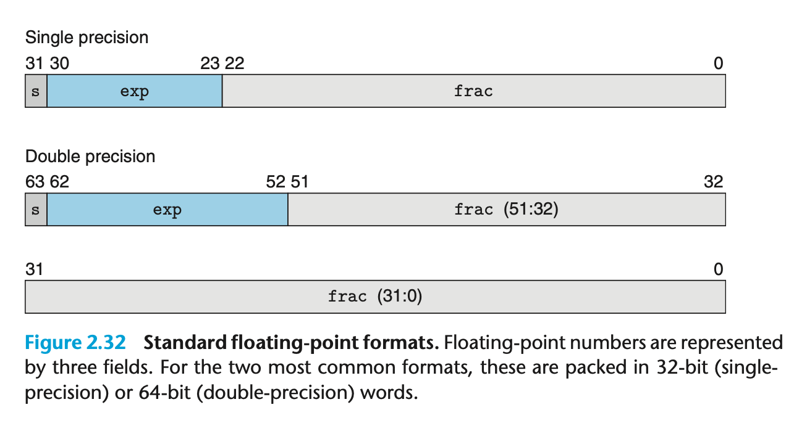
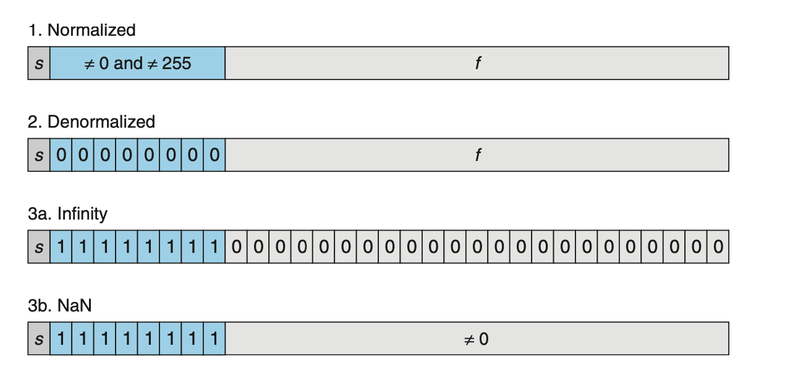
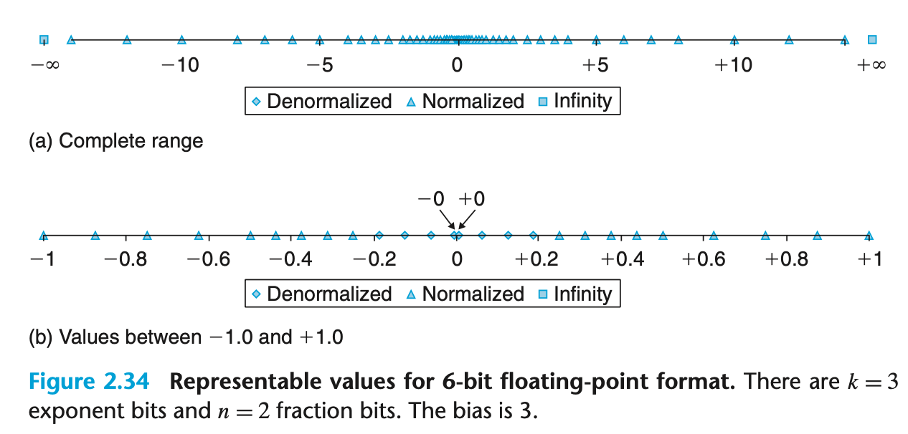
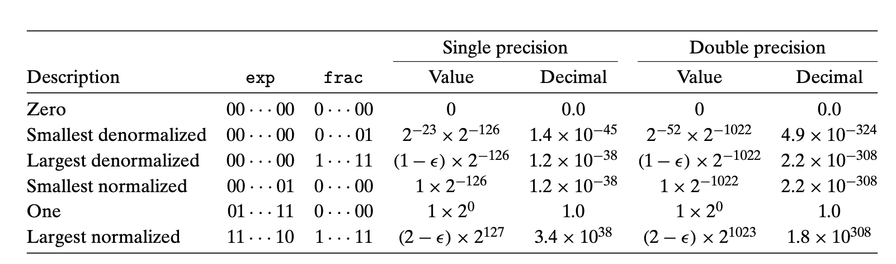
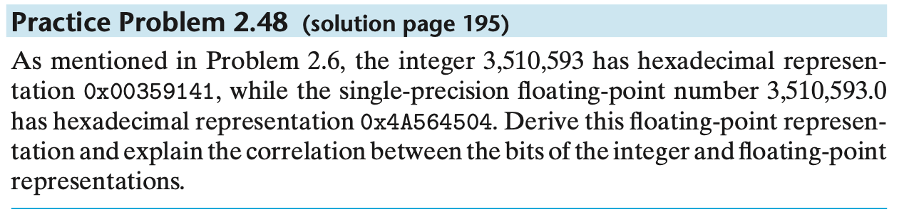
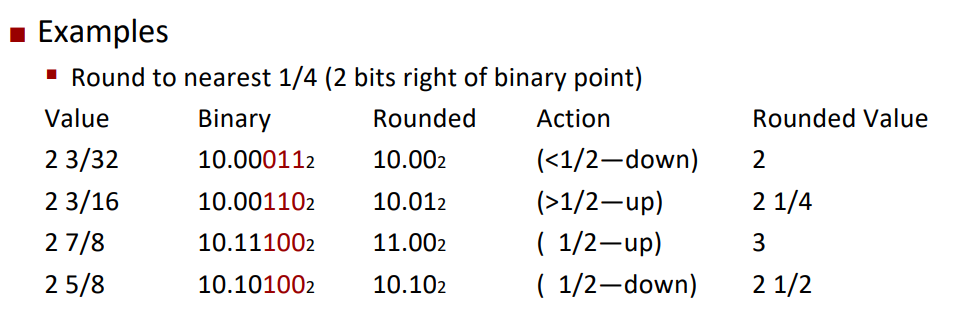

[TOC]

## Representing and Manipulating Information

### Floating Point 浮点数

$V = (-1)^s\times M\times 2^E$

- *s*-- sign bit 符号位
- *M*--中文翻译为尾数，其实就是有效数(signifcant) ranger $(1,2-\delta)or(0,1-\delta)$,其中$\delta$是一个很小的树
- *E*--移码(exponent) 



**浮点数的表示‼️**

区分四种类型(规格数(nomalized)、非规格数(denomalized)、无穷(infinity)、非数（NaN))



重点关注规格数与非规格数表示的区别

**规格数**

- 一位**s** 表示符号，8位/11位表示阶码，剩余位数表示尾数
- E = $2^e - bias$ (其中偏置为$2^{k-1}-1$,k为阶码位数)
- M = 1.f (规格数采用隐藏前导1的方法来扩大精度)

举个例子

```markdown
5-bit float-point , k = 2, n = 2, bias = 2^1 - 1 =1
表示规格数解读方法如下	
0 01 00
|--|--|->符号位(s)表示正数
    |--|----->01表示e，则E=1*2^0-1=1
       |------>00表示f,则M=1.f=1
 由公式V=2^E x M=1
 
```

**非规格数**

- 一位 **s**表示符号，阶码部分全部为0，剩余部分表示尾数
- 非规格数E=1-bias(所有的非规格数都是这么大)
- M=0.f，不采用隐藏前导1

举个例子

```markdown
0 00 10
|--|--|----> 符号位表示正数
    |--|---------> 00 表示这是一个非规格数 且E=2^(1-bias)=1
       |----------> 10 表示尾数M=0.f=1/2=0.5
 由公式V=2^E x M=0.5
```

其余两种只需要认清楚，∞或者NaN需要阶码部分全部为1，若尾数部分全0则为无穷，否则为NaN.

> [!note]
>
> 
>
> 浮点数的设计保证了规格数>非规格数，非规格数的目的就是为了表示0(+0和-0)和非常靠近0的小数。
>
> 一些重要的数
>
> 

浮点数与整数

以课本Problem 2.48的习题为案例解释一下这个知识点吧



整数 0x00359141二进制表示如下

```markdown
11  0101 1001 0001 0100 0001
```

转化为规格化数的话应该先左移21位变成

```markdown
1.1 0101 1001 0001 0100 0001 x 2^{21}
```

从而E=21,E=e-bias(127)知e=148=128+16+4=1001 0100（8位)

加上一位符号位表示正数s=0(1位)

还需要32-1-8=23位表示f，规格数隐藏前导1则f=1 0101 1001 0001 0100 0001(21位),加上2位凑足23位 = 1 0101 1001 0001 0100 0001 00

所以最终的规格化浮点数为
```markdown
0100 1010 0101 0110 0100 0101 0000 0100(即题目给的0x4A564504)
            **************************
           1101  0110 0100 0101 0000 01
```

相同的尾数即隐藏前导1的整数部分.

**Rounding舍入**

IEE754的标准舍入方式为Round-to-even(向偶数舍入)，向偶数舍入会有一个很特殊的情况。



对于大于半数的采用向上舍入，小于半数的采用向下舍入，而刚好半数的需要“向偶数舍入”,如上所示。

**Floating-Point Operations**

> 浮点数的运算大体上和整数没有区别，但有几个细节。
>
> 由于舍入的存在，浮点数并不支持分配律。
>
> 如(3.14 + 1e^10) - 1e^10 = 0而3.14 + (1e^10 - 1e^10)=3.14，前者由于舍入把3.14忽略了。
>
> 乘法也是同理，但同时浮点数满足一定的单调律
>
> $if\ a\geq\ b,then\ x + ^fa\geq x+^fb$,只要x,a,b没有NaN即可
>
> $$a\geq b\ \ and\ \ c\geq0(\leq0)\implies a *^fc\geq(\leq)b*^fc $$ 要求$a\neq NaN$
>
> 这是整数(无论是有符号数(补码)还是无符号数)都没有这种显而易见的单调性！

**C 语言中的浮点数**

> [!Caution]
>
> C标准并不要求机器使用IEE754实现浮点数，所以类似于∞\NaN \\-0之类的特殊值是不能直接使用的。

float double int 之间的类型转换

> [!warning]
>
> 使用强制类型会可能会丢失精度，但使用指针在底层重新解读可以保证精度。只要解读的内存块大小正确，否则会导致非法访问！

- from int to float, 可能发生舍入
- from int or float to double 可以保证数值，并且可获得更高的进度
- from float or double to int.数值会向0舍入
