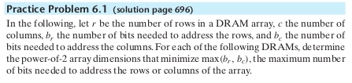
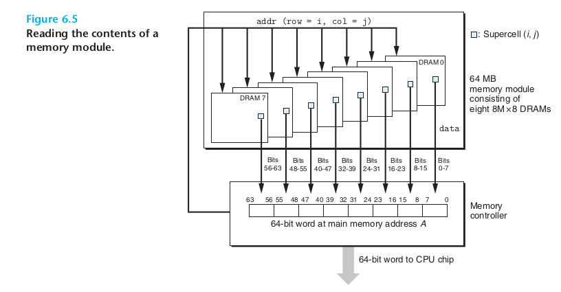

[TOC]

## 课本上带答案的练习题

### chapter 2 Refresenting and Manipulating Information

### chapter 3 Machine_Program

#### 3.1

### chapter 6 The Memory Hierarchy

#### 6.1 行/列个数的选择

**结论是：让行和列数尽可能接近，并且行数小于列数(DRAM按行刷新，行数少刷新次数也少)**

.png)

Sol

	<pre>
	b_r=log(r),b_c=log(c)
	</pre>

