[TOC]

## Lab

> ### Lab是CSAPP的精华
>
> 要尽量自己独立的完成，可以借助网络资源来完善和提醒，切忌不能看别人的实现然后简单的copy一份！

### Data Lab

#### **bitxor**

题目分析，仅用`~(按位取反)` and `&(按位与)`，本质上一道逻辑运算的习题。

$A\oplus B=?$

1. 显而易见的一种

$A \oplus B = \sim (A \& B) \& (\sim A \& \sim B)$

#### tmin 

返回二进制最小的值(0x80000000) = $-2^{31}$ 

最直接的想法就是用1然后左移动31位

允许使用的整数为(0x0 ~0xff(255)),咋直接定义一个最大整数是不合理的。

#### isTmax ?

二进制最大的数为(0x7ffffff) = $2^{31} - 1$ 

#### alloddbits

判断某个数的二进制表示的奇数位是否全为`1`

> Input: 0xFFFFFFFD
>
> Output: 0
>
> Expian:
>
> D = 1101
>
> ​       |-----> 位置1(奇数)对于的二进制数为`0`而非`1`
>
> Input: 0xAAAAAAAA
>
> Output: 1
>
> Expian:
>
> 1010 1010 .... 1010
>
>  |  |  |  |         |  | ----> 所有奇数位都为`1`  

### Bomb Lab

> [!important]
>
> 主要目标是学会利用gdb调试汇编代码，并能阅读汇编代码。

一共有6个phase和一个隐藏关卡

| gdb命令      | 备注                                       |
| ------------ | ------------------------------------------ |
| `layout xxx` | - asm 汇编代码 - src 源代码           |
| `run/r`      | 运行                                       |
| `break/b`    | 设置断点 - 直接接函数名 - *+地址 |
| `ni`         | 下一条汇编指令                             |
| `si`         | 步入下一条汇编指令                         |

#### ==Phase_1==

无论如何先在main函数设置一个断点，看看程序是如何运行的为好。

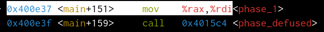

查看一下phase_1的反汇编结果

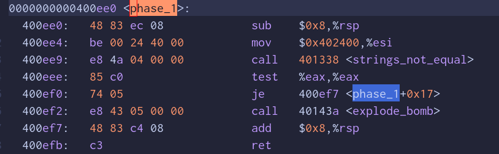

很容易发现调用了一个`string_not_equal`函数，并且如果测试成功则不会进入`explode_bomb`否则就会引爆💣，所以关键就是这个调用

而这个`mov $0x402400, $esi` 显然是把我们的输入的字符串作为参数传入这个`strings_not_equal`,我们只需要进入这个函数看一下，它想要得到那个字符串就可以。

立刻去看看吧！

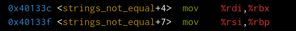

`%rbx 保存输入， %rbp 肯定的带比较结果` 可以用x/s打印看一下

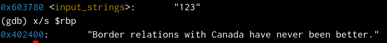

第一题还是比较简单的

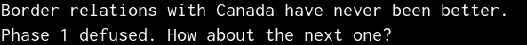

#### ==Phase_2==

> [!warning]
>
> 可以把上一题的答案写入一个文件然后用`set args xxx.txt`设置为参数，就不需要每次都重复输入结果了

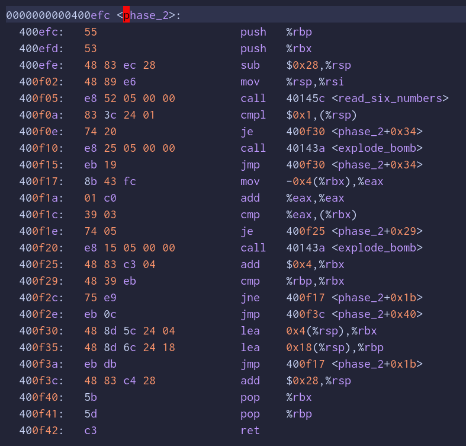

通过上一题大概可以知道，主要的测试就是`phase_x`里面，所以可以直接打端点看看

函数名都提示了要输入6个整数，所以如果输入的不是6个整数的话重新解密吧！

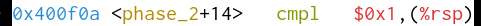 执行完`read_six_numbers`后就要比较,`($rsp)`对应的为我们输入的第一个数字，这里要求为`0x1`哦，如果不是下一步就直接call `explode_bomb`

> [!important]
>
> 第一个数字为 `1`

执行跳转到这一步，显然是把第二个变量对应的内存地址，写入$rbx中

执行执行，到这个

把上一个输入`1`存入了`$eax`

这里相当于`args1+args1 ? args2`

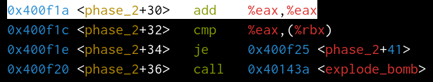

通过测试条件我们可知，如果不等咋会引爆，所以可以得到答案应该是`1 2 4 8 16 32`

#### ==Phase_3==

这个汇编代码就比较长了

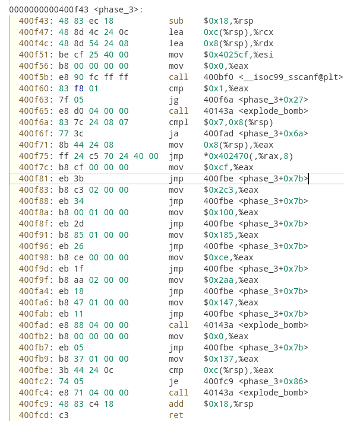

`0x400f5b` ---> sscanf 调用并返回接受参数的个数，可以发现这个判断需要让`$eax > 1` 即至少有要有两个输入

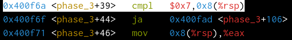

可以用`x $rsp+0x8`查看，会发现是第一个输入，如果第一个输入大于`0x7`则跳转，但这个地址吧就是` explode_bomb`，否则把`args1`存入`%eax`,并且`args1=1`的情况,

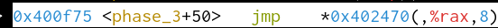

这条指令是跳转到 0x402470 + 8%rax 对应的内存地址

把`0x137`存入`%eax`

这里会比较`args2`和`0x137(311)`

即第二个参数为311时候就拆除成功了

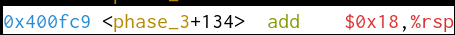

同理当`args1<=7`并且等于其他值的时候也有答案

| arg 1 | arg 2 |
| ----- | ----- |
| 1     | 0x137 |
| 2     | 0x2c3 |
| 3     | 0x100 |
| 4     | 0x185 |
| 5     | 0xce  |
| 6     | 0x2aa |
| 7     | 0x147 |

### Attack Lab

### Arch Lab

### Cache Lab

### Tsh Lab

#### Malloc Lab

#### Proxy Lab

