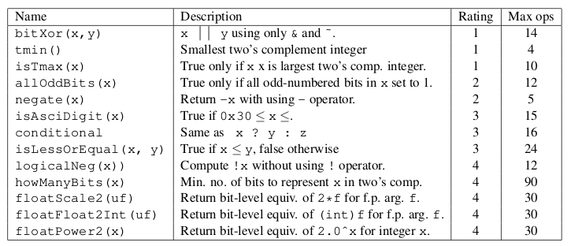

[TOC]

## Lab

> ### Lab是CSAPP的精华
>
> 要尽量自己独立的完成，可以借助网络资源来完善和提醒，切忌不能看别人的实现然后简单的copy一份！

### Data Lab



#### **bitxor**

题目分析，仅用`~(按位取反)` and `&(按位与)`，本质上一道逻辑运算的习题。

$A\oplus B=?$

1. 显而易见的一种

$A \oplus B = \sim (A \& B) \& (\sim A \& \sim B)$

```c
```

#### tmin 

返回二进制最小的值(0x80000000) = $-2^{31}$ 

最直接的想法就是用1然后左移动31位

允许使用的整数为(0x0 ~0xff(255)),咋直接定义一个最大整数是不合理的。

#### isTmax 

二进制最大的数为(0x7ffffff) = $2^{31} - 1$ 


### Bomb Lab

### Attack Lab

### Arch Lab

### Cache Lab

### Tsh Lab

#### Malloc Lab

#### Proxy Lab

