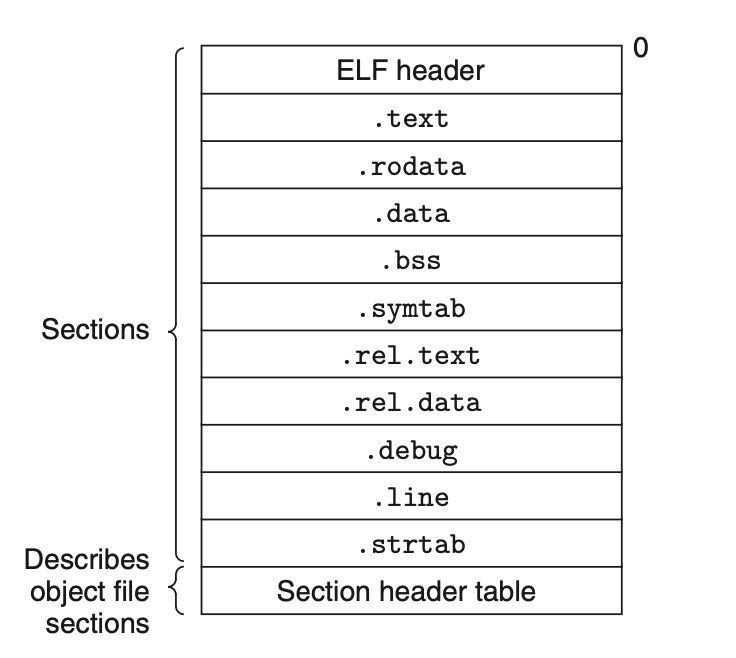

## Linking

[TOC]

进阶阅读资料

中文：《程序员自我修养：链接、装载与库》

英文:**Linkers and Loaders” by John R. Levine**

> [!note]
>
> Linking is the process of collecting and combining various pieces of code and data into a single file that can be loaded into memory and executed.

- Understanding linkers will help you build large programs.
- Understanding linkers will help you avoid dangerous programming errors.
- Understanding linking will help you understand how language scoping rules are implemented.
- Understanding linking will help you understand other important systems concepts.
- Understanding linking will enable you to exploit shared libraries.

链接可以发生在(编译时--静态、装载时、运行时)

### static link and ELF (静态链接与ELF)

**Compiler driver**:Compiling source code to executable programm

- Preprocessor,compiler,assemble,and linker

```bash
linux> gcc -og -o prog main.c sum.c
```


所谓静态链接就是在编译生成可执行文件的时候就把所有的链接工作完成了，生成的文件`prog`不需要其他的文件就可以直接通过`shell`内置的`loader(装入器)`载入内存执行。

```bash
./prog
```

具体来说分两步

- Symbol resolution 符号解析 to associate each symbol reference with exactly one symbol definition.
- Relocation 重定位 Linker blindly performs these relocations using detailed instructions,generated by the assemble, called relocation entries. 
  - 编译与汇编产生的代码与数据段仍然是以0为初始地址的相对地址
  - 通过符号解析的结构进行重定位
  - 重定位主要由汇编器决定，由链接器执行。


**object module vs object files**

- object module : a sequence of bytes
- object files : an object module stored on disk in a file

ELF: executable and linkable format , Unix systems and x86-64 linux's object file formats.



图2:典型的ELF格式的可重载文件格式

不同段有不同的含义

- *ELF header* begins wiht a 16-bytes sequence that descibes the word size and byte ordering of the system that generated the file and the rest of ELF header contains information tha allows a linker to parse(解析) and interpret the objet file.
  - Object file type: relocatable, exeutable, shared
  - machine type(x86-64)
  - file offset of the section header table
  - the size and number of entries in the section header table.
- *Section header table*。每个节头描述了一个节的属性，例如节的类型、大小、虚拟地址、偏移量等。它帮助链接器和加载器识别文件中的各个节，并决定如何加载和使用它们。

> [!note]
>
> ELF 头部以一个 16 字节的序列开始，该序列描述了生成文件的系统的字长和字节顺序。ELF 头部的其余部分包含了允许链接器解析和解释目标文件的信息。这些信息包括 ELF 头部的大小、目标文件类型（如可重定位、可执行或共享）、机器类型（如 x86-64）、节头表的文件偏移量，以及节头表中条目的大小和数量。节头表描述了各个节的位置和大小，它为目标文件中的每个节包含一个固定大小的条目。

| 节名称      | 描述                                      | 示例用途                                                     |
| ----------- | ----------------------------------------- | ------------------------------------------------------------ |
| `.text`     | 存储程序的可执行代码                      | 包含程序的实际代码部分                                       |
| `.data`     | 存储已初始化的数据                        | 包含程序中已初始化的全局变量和静态变量                       |
| `.bss`      | 存储未初始化的数据                        | 包含程序中的未初始化全局变量和静态变量、以及任何任何初始为0的全局或者静态变量。 |
| `.symtab`   | 存储符号表                                | 包含程序中所有符号的信息，如函数、变量名等                   |
| `.strtab`   | 存储字符串表                              | 包含符号表中符号的字符串名称                                 |
| `.rel.text` | 存储对 `.text` 节的重定位信息             | 用于动态链接时的重定位信息                                   |
| `.rodata`   | 存储只读数据 Read-only data               | 包含常量数据，如字符串常量和常量数组                         |
| `.eh_frame` | 存储异常处理信息                          | 包含异常处理机制所需的数据，通常用于栈展开和异常处理         |
| `.debug`    | 存储调试信息 `-g`                         | 包含调试符号和调试数据，调试器使用这些信息来进行调试         |
| `.note`     | 存储与目标文件相关的注释信息              | 包含与目标文件的构建或其它元数据相关的注释信息               |
| `.dynamic`  | 存储动态链接信息                          | 包含与动态链接有关的数据和符号表条目                         |
| `.plt`      | 存储过程链接表（Procedure Linkage Table） | 用于动态链接的函数调用                                       |
| `.got`      | 存储全局偏移表（Global Offset Table）     | 用于动态链接中的地址重定位，指向共享库中的函数和变量         |
| `.ctors`    | 存储构造函数信息                          | 包含程序启动时需要调用的构造函数                             |
| `.dtors`    | 存储析构函数信息                          | 包含程序结束时需要调用的析构函数                             |

### Symbols and Symbols Tables

三种符号类型

- Global symbols that are defined by module m and thaat can be referenced by other modules.
  - Nostalgic function and global variables 
- Global symbols that are referenced by module m but defined by some other module
  - nonstatic C functions and global variables that are defined in other modules.
- Local symbols that are defined and referenced exclusivly by module m.
  - static C functions and global variables that are defined with the static attribute.
  - visible anywhere within module m,but cannot be referenced by other modules.

> [!warning]
>
> 本地变量在运行时保存于栈上。

