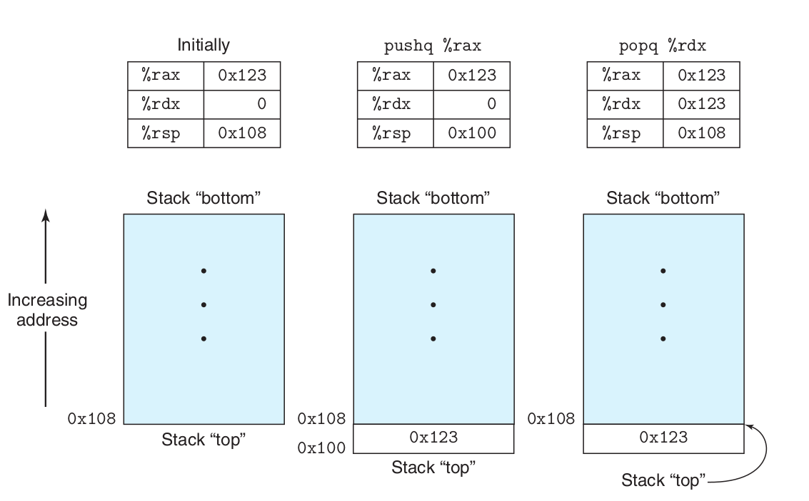
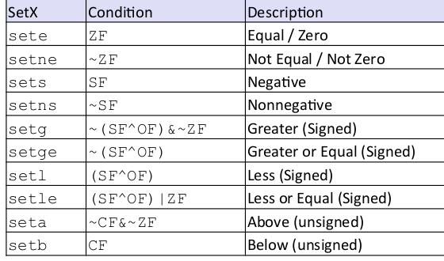
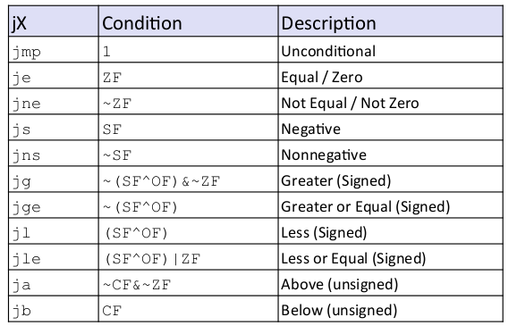
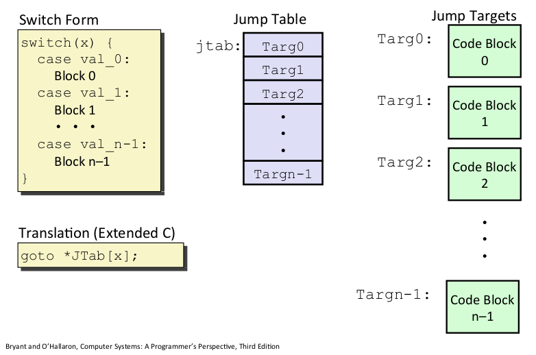

## Machine Programm

[TOC]

### Part I basic 3.1 - 3.5
CSAPP以`x86-64`为案例介绍
> x86 - 64 位机器有`16`个64位的寄存器
> %rax - %rbp 是从16位机器拓展而来，而%r8 - %r15 是64位机器新加的

**操作64位寄存器的低位分为两种情况**
1. 操作单字（16位）、半字（8位），不会影响影响高位数据
2. 操作双字（32位）会把高32位置为0 

最特殊的寄存器`%rsp`---`stack pointer` 栈指针:indicate the end position in the run-time stack.

$Imm(r_b,r_i,s)$ as $Imm + R[r_b] + R[r_i] \times s$ 将用于数组或在更复杂的结构用于寻址

| Instruction | Effect                              | Description             |
| ----------- | ----------------------------------- | ----------------------- |
| Mov         | S,D   D$\leftarrow$ S               | Move                    |
| movb        |                                     | Move byte               |
| movw        |                                     | Move word               |
| movl        |                                     | Move double word        |
| movq        |                                     | Move quad word          |
| movabsq     | *I, R*              $R\leftarrow I$ | Move absolute quad word |

> ### x86不允许 move的两个操作数都是内存地址，即不允许 M - M的直接数据移动

```assem
movabsq $0x0011223344556677, %rax        %rax = 0011223344556677
movb    $-1,                 $al         $rax = 00112233445566FF
movw    $-1,                 $ax         $rax = 001122334455FFFF
movl    $-1                  $eax        $rax = 00000000FFFFFFFF //唯一特殊的，会把高32位置0
movq    $-1                  $rax        $rax = FFFFFFFFFFFFFFFF
```

`mov`拓展  `movz(零拓展)` & `movs(符号拓展)`

`cltq` 

> %rax  $\leftarrow$ SignExtend($eax)  专用于%rax 与 %eax的符号拓展

```assem
movabsq $0x0011223344556677, %rax        %rax = 0011223344556677
movb    $0xAA                %dl         	 %dl = AA
movb    %dl                  %al          	 %rax = 00112233445566AA
movsbq  %dl                  %rax         %rax = FFFFFFFFFFFFFFAA
movzbq  %dl                  %rax       	  	 %rax = 00000000000000AA
```


####  习题实现：*dp = (dest_t) *sp;

| src_t          | dest_t        | Instruction            |
| -------------- | ------------- | ---------------------- |
| long           | long          | **movq (%rdi), %rax**  |
|                |               | **movq %rax, (%rsi)**  |
| char           | int           | **movb (%rdi), %al**   |
|                |               | **movsbl %al, (%rsi)** |
| char           | unsigned      | **movb (%rdi), %al**   |
|                |               | **movzbl %al, (%rsi)** |
| unsigned char  | long          | **movb (%rdi), %al**   |
|                |               | **movsbq %al, (%rsi)** |
| int            | char          | **movl (%rdi), %eax**  |
|                |               | **movb %eax, (%rsi)**  |
| unsigned (int) | unsigned char | **movl (%rdi), %eax**  |
|                |               | **movb %eax, (%rsi)**  |
| char           | short         | **movb (%rdi), %al**   |
|                |               | **movsbw %al, (%rsi)** |


`push & pop`

| Instruction | Effect                             | Description    |
| ----------- | ---------------------------------- | -------------- |
| pushq S     | $R[\%rsp]\leftarrow R[\%rsp] - 8;$ | Push quad word |
|             | $M[R[\%rsp]] \leftarrow S$         |                |
| popq D      | $D \leftarrow M[R[\%rsp]];$        | Pop quad word  |
|             | $R[\%rsp] \leftarrow R[\%rsp] + 8$ |                |



####  `leaq` Load Effective Address

> **It has the form of an instruction that reads from memory to a register,but it does not reference memory at all.**

$leaq\ \ \ \  S,D\ \ \ \  D \leftarrow \&S$


### Part II control 3.6

> # 主要内容
>
> 1. **Control:COndition Codes**
>
> 2. **Conditional branches**
>
> 3. **Loops**
>
> 4. **Switch Statements**

两个特殊的寄存器
`%rsp --- 栈指针寄存器`
`%rip --- Instruction pointer`

特殊的标志位Status of recent tests

`CF` `ZF` `SF` `OF` ---Condition codes

- CF (Carry Flag for unsigned)
- SF (Sign Flag for signed)
- ZF (Zero Flag)
- OF (Overflow Flag for signed)


- [**Implicityly setting** by arithmetic operations]

**NOt set by`leaq` instruction **

[**Explicit setting** by Compare Instruction]

- cmpq Src2 Src1 #Src1 : Src2
- cmpq b,a as computing a - b without setting destination

[**Explict seeting** by Test instruction]

- testq Src2,Src1 
- as computing a&b without setting destination

Sets condtion codes based on value of Src1&Src2
- ZF set when a&b == 0
- SF set when a & b < 0

**Setx instructions**


**jX instructions**
condition jump & no-condition jump


gcc -Og -S -fno-if-conversion absiff.c  

`-fno-if-conversion` close conditional moves

```assmable
.LFB0:
	cmpq	%rsi, %rdi
	jle	.L2     #根据cmpq设置的条件码跳转
                #.L2是一个标签
	movq	%rdi, %rax
	subq	%rsi, %rax
	ret
.L2:
	movq	%rsi, %rax
	subq	%rdi, %rax
	ret
```
也可以写成`goto`虽然C有goto但实际写代码十分不推荐用
```c
long absdiff_j (long x, long y)
{
    long result;
    int ntest = x <= y;
    if (ntest) goto Else;
    result = x - y;
    goto Done;
Else:
    result = y - x;
Done:
    return result;
}
```
`Condition Move` 编译器会对简单的计算分支进行优化

`absdiff.c`的优化版本为

```assmable
absdiff:
	movq	%rdi, %rdx # x
	movq	%rsi, %rax # result = x - y
	subq	%rsi, %rdx
	subq	%rdi, %rax # eval = y - x
	cmpq	%rsi, %rdi # x : y
	cmovle	%rdx, %rax # if <=, result = eval
	ret
```

`Do-While` `While` `For`

`Do-While` -> `Goto` 参考[pcount_goto.s](./Condition/pcount_goto.s)

`while` -> `Goto Version` -Og > `Jump to Miidle`

`while` -> `DO-while` -> `Goto` -O1

`For` ---> `Init` + `Test` + `Update` + `Body` ---> `while`

**Swithc Statement**
参考代码[switch_eg.c](./Condition/switch_eg.c) 与 [switch_eg.s](./Condition/switch_eg.s)



编译器会为case 0 ~ case 6的每一个case建立一个`Jump Table`表项，即使它在源代码里面没有，并且会采用偏置的方法使得case总是从0开始。如果只有两个case，一个为1一个为100000,也会为0-9999建立表项，这时候就会采用二分来查找则退化为o(logn)

> ##### `if - else`  VS `switch`
>
> 如果分支跳转的情况连续并且稠密，使用`switch`从性能和编码上都由于`if-else`,否则二者差距不大。
>
> PS:如今的编译器对于二者优化导致二者性能差距几乎消失不见。

### Part III Procedures 3.7

> # 主要内容
>
> - Stack Structure 栈结构
> - Callling Conventions 调用约定
>   - Passing control
>   - Passing data
>   - Managing local data
> - Illustration of Recursion 递归简介

### Part IV Data  3.8 - 3.9 3.11

> # 主要内容
>
> - Arrays 数组
>   - One-dimensional
>   - Multi-dimensional
>   - Multi-level 
> - Structures 结构体
>   - Allocation 分配
>   - Access 访问
>   - Alignment 对齐
> - Floating Point 浮点数

### Part V Advanced 3.10

> # 主要内容
>
> - Memory Layout 内存布局
> - Buffer Overflow 缓冲区溢出
>   - Vulnerability 漏洞
>   - Protection 保护
> - Unions 联合体

