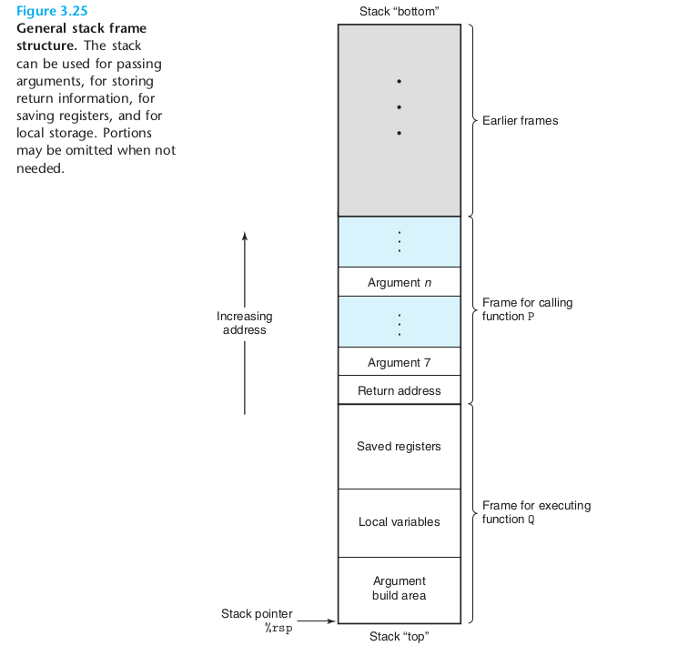
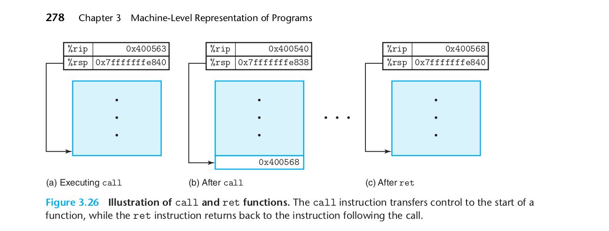
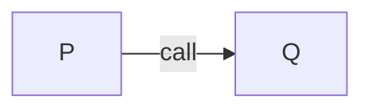
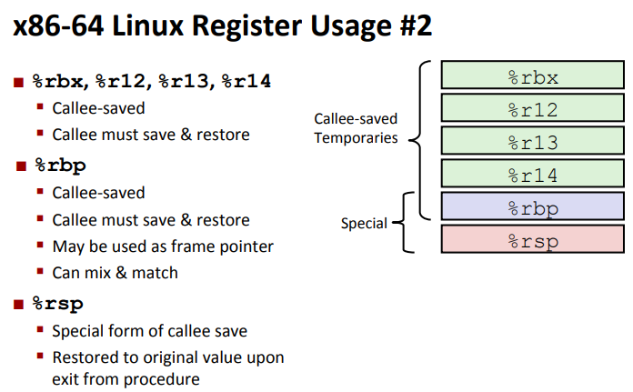
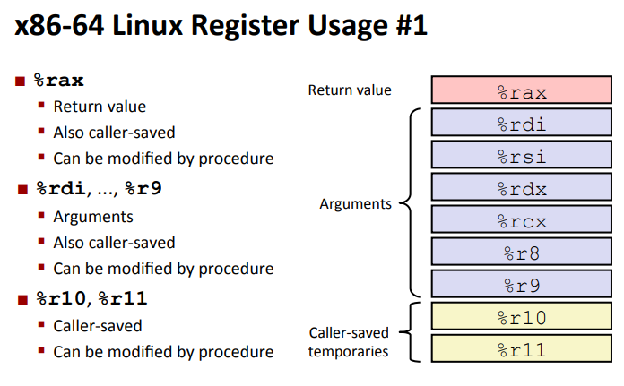
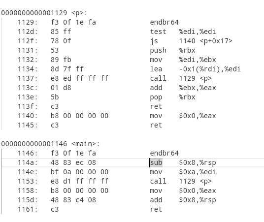
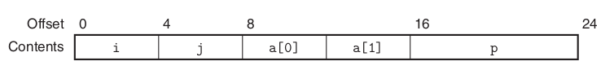
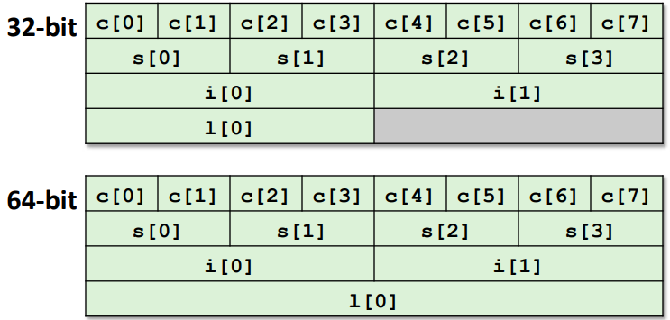
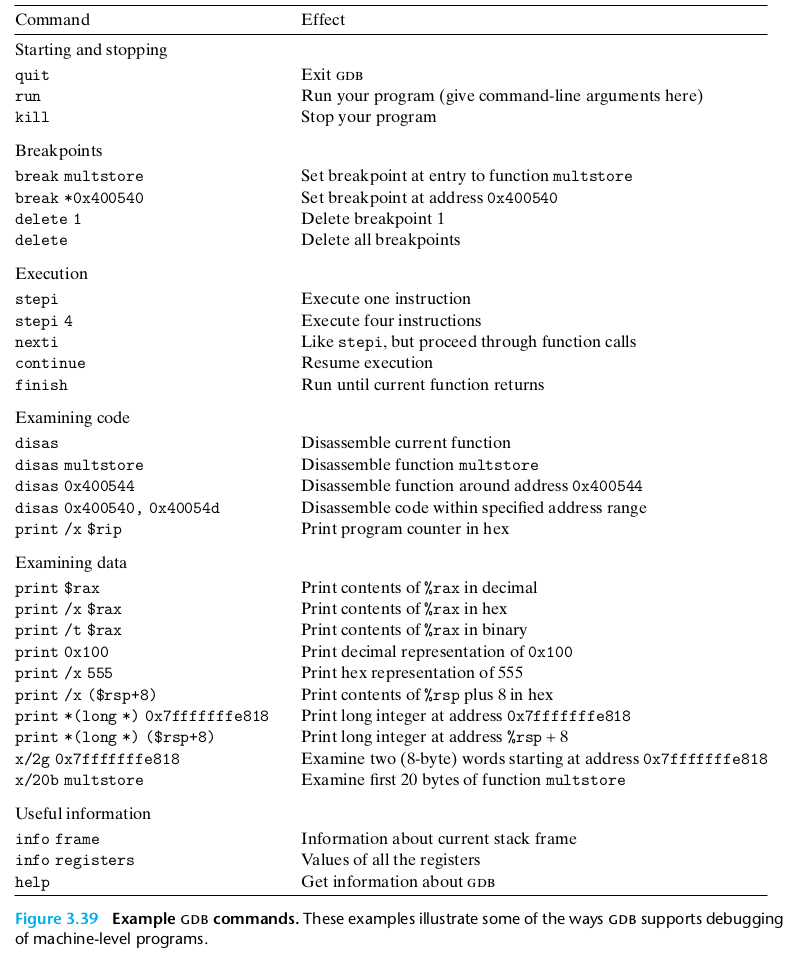
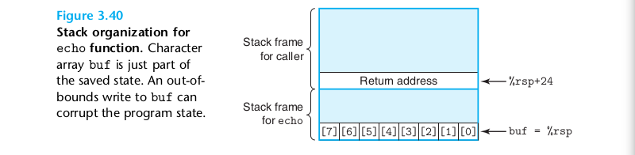

## Machine Programm

[TOC]

### Part I basic 3.1 - 3.5
CSAPP以`x86-64`为案例介绍
> x86 - 64 位机器有`16`个64位的寄存器
> %rax - %rbp 是从16位机器拓展而来，而%r8 - %r15 是64位机器新加的

**操作64位寄存器的低位分为两种情况**
1. 操作单字（16位）、半字（8位），不会影响影响高位数据
2. 操作双字（32位）会把高32位置为0 

最特殊的寄存器`%rsp`---`stack pointer` 栈指针:indicate the end position in the run-time stack.

$Imm(r_b,r_i,s)$ as $Imm + R[r_b] + R[r_i] \times s$ 将用于数组或在更复杂的结构用于寻址

| Instruction | Effect                              | Description             |
| ----------- | ----------------------------------- | ----------------------- |
| Mov         | S,D   D$\leftarrow$ S               | Move                    |
| movb        |                                     | Move byte               |
| movw        |                                     | Move word               |
| movl        |                                     | Move double word        |
| movq        |                                     | Move quad word          |
| movabsq     | *I, R*              $R\leftarrow I$ | Move absolute quad word |

> ### x86不允许 move的两个操作数都是内存地址，即不允许 M - M的直接数据移动

```assem
movabsq $0x0011223344556677, %rax        %rax = 0011223344556677
movb    $-1,                 $al         $rax = 00112233445566FF
movw    $-1,                 $ax         $rax = 001122334455FFFF
movl    $-1                  $eax        $rax = 00000000FFFFFFFF //唯一特殊的，会把高32位置0
movq    $-1                  $rax        $rax = FFFFFFFFFFFFFFFF
```

`mov`拓展  `movz(零拓展)` & `movs(符号拓展)`

`cltq` 

> %rax  $\leftarrow$ Sign Extend($eax)  专用于%rax 与 %eax的符号拓展

```assem
movabsq $0x0011223344556677, %rax        %rax = 0011223344556677
movb    $0xAA                %dl         	 %dl = AA
movb    %dl                  %al          	 %rax = 00112233445566AA
movsbq  %dl                  %rax         %rax = FFFFFFFFFFFFFFAA
movzbq  %dl                  %rax       	  	 %rax = 00000000000000AA
```


####  习题实现：*dp = (dest_t) *sp;

| src_t          | dest_t        | Instruction            |
| -------------- | ------------- | ---------------------- |
| long           | long          | **movq (%rdi), %rax**  |
|                |               | **movq %rax, (%rsi)**  |
| char           | int           | **movb (%rdi), %al**   |
|                |               | **movsbl %al, (%rsi)** |
| char           | unsigned      | **movb (%rdi), %al**   |
|                |               | **movzbl %al, (%rsi)** |
| unsigned char  | long          | **movb (%rdi), %al**   |
|                |               | **movsbq %al, (%rsi)** |
| int            | char          | **movl (%rdi), %eax**  |
|                |               | **movb %eax, (%rsi)**  |
| unsigned (int) | unsigned char | **movl (%rdi), %eax**  |
|                |               | **movb %eax, (%rsi)**  |
| char           | short         | **movb (%rdi), %al**   |
|                |               | **movsbw %al, (%rsi)** |


`push & pop`

| Instruction | Effect                             | Description    |
| ----------- | ---------------------------------- | -------------- |
| pushq S     | $R[\%rsp]\leftarrow R[\%rsp] - 8;$ | Push quad word |
|             | $M[R[\%rsp]] \leftarrow S$         |                |
| popq D      | $D \leftarrow M[R[\%rsp]];$        | Pop quad word  |
|             | $R[\%rsp] \leftarrow R[\%rsp] + 8$ |                |


####  `leaq` Load Effective Address

> **It has the form of an instruction that reads from memory to a register,but it does not reference memory at all.**

$leaq\ \ \ \  S,D\ \ \ \  D \leftarrow \&S$

### Part II control 3.6

> # 主要内容
>
> 1. **Control:Condition Codes**
>
> 2. **Conditional branches**
>
> 3. **Loops**
>
> 4. **Switch Statements**

两个特殊的寄存器
`%rsp --- 栈指针寄存器`
`%rip --- Instruction pointer`

特殊的标志位Status of recent tests

`CF` `ZF` `SF` `OF` ---Condition codes

- CF (Carry Flag for unsigned)
- SF (Sign Flag for signed)
- ZF (Zero Flag)
- OF (Overflow Flag for signed)


- [**Implicitly setting** by arithmetic operations]

**Not set by`leaq` instruction **

[**Explicit setting** by Compare Instruction]

- cmpq Src2 Src1 #Src1 : Src2
- cmpq b,a as computing a - b without setting destination

[**Explicit sting** by Test instruction]

- testq Src2,Src1 
- as computing a&b without setting destination

Sets condition codes based on value of Src1&Src2
- ZF set when a&b == 0
- SF set when a & b < 0

**Set instructions**


**jX instructions**
condition jump & no-condition jump


gcc -Og -S -fno-if-conversion absiff.c  

`-fno-if-conversion` close conditional moves

```assmable
.LFB0:
	cmpq	%rsi, %rdi
	jle	.L2     #根据cmpq设置的条件码跳转
                #.L2是一个标签
	movq	%rdi, %rax
	subq	%rsi, %rax
	ret
.L2:
	movq	%rsi, %rax
	subq	%rdi, %rax
	ret
```
也可以写成`goto`虽然C有goto但实际写代码十分不推荐用
```c
long absdiff_j (long x, long y)
{
    long result;
    int ntest = x <= y;
    if (ntest) goto Else;
    result = x - y;
    goto Done;
Else:
    result = y - x;
Done:
    return result;
}
```
`Condition Move` 编译器会对简单的计算分支进行优化

`absdiff.c`的优化版本为

```assmable
absdiff:
	movq	%rdi, %rdx # x
	movq	%rsi, %rax # result = x - y
	subq	%rsi, %rdx
	subq	%rdi, %rax # eval = y - x
	cmpq	%rsi, %rdi # x : y
	cmovle	%rdx, %rax # if <=, result = eval
	ret
```

`Do-While` `While` `For`

`Do-While` -> `Goto` 参考[pcount_goto.s](./Condition/pcount_goto.s)

`while` -> `Goto Version` -Og > `Jump to Miidle`

`while` -> `DO-while` -> `Goto` -O1

`For` ---> `Init` + `Test` + `Update` + `Body` ---> `while`

**Swithc Statement**
参考代码[switch_eg.c](./Condition/switch_eg.c) 与 [switch_eg.s](./Condition/switch_eg.s)


编译器会为case 0 ~ case 6的每一个case建立一个`Jump Table`表项，即使它在源代码里面没有，并且会采用偏置的方法使得case总是从0开始。如果只有两个case，一个为1一个为100000,也会为0-9999建立表项，这时候就会采用二分来查找则退化为o(logn)

> ##### `if - else`  VS `switch`
>
> 如果分支跳转的情况连续并且稠密，使用`switch`从性能和编码上都由于`if-else`,否则二者差距不大。
>
> PS:如今的编译器对于二者优化导致二者性能差距几乎消失不见。

### Part III Procedures 3.7

> # 主要内容
>
> - Stack Structure 栈结构
> - Calling Conventions 调用约定
>   - Passing control
>   - Passing data
>   - Managing local data
> - Illustration of Recursion 递归简介

**stack is last-in and first-out data stucure.**

> ### Grows toward lower addresses 
>
> 
>
> ==%rsp points to the top element of the stack==
>
> ```
> // allocated on the stack by  decrementing the stack pointer ----pushq
> // deallocated by incrementing the stack pointer ---- popq
> ```
>
> > [!Important]
> >
> > The stack frames for most procedures are of **fixed size**,allocated at the beginning of the procedure.
> >
> > but some procedures require variable-size frames.
>
> // TODO 

As shown in picture 5,the arguments start 7. In x86-64,  six or fewer arguments can be passed in registers.

<details><summary>Leaf Procedure</summary>
    <dir>
        when all of the local variables can be held in registers and the function does not all any other functions,the function not requir a stack frame.
    </dir>
</details> 

#### Pass Control

The two most important instruction are `callq` and `retq`

| Instruction   | Description      |
| ------------- | ---------------- |
| call Label    | Procedure call   |
| call *Operand | Procedure call   |
| ret           | Return from call |

call has two targets that the `Label` is direct and the `*Operand` is indirect.



> ### `%rip` serves as the program counter, pointing to the currently executing instruction within a functions

#### Data Transfer

> [!Important]
>
> With x86-64,up to six integral(i.e. integer and pointer)arguments can be passed via registers. And these registers are fixed and return value is stored `%rax`.
>
> For x86-64,
>
> | x86-64 | `1:%rdi` | `2:%rsi` | `3:%rdx` | `4:%rcx` | `5:%r8` | `6:%9` |
> | ------ | -------- | -------- | -------- | -------- | ------- | ------ |
>
> In Picture 5, additional arguments for the stack are shown, with argument 7 located at the top of the stack.

#### Local Storage on the Stack



P is caller and Q is callee.

>  # *callee saved register and caller saved register*
>
> - Callee saved register: `%rbx`, `$rbp` and `%r12-%r15`,special `%rsp` 
>   - 
>   - Q must preserve the values of these registers,ensuring that they have the same value when Q returns to P.
>     - option 1: not changer these registers.
>     - option 2: push the old value of these registers to stack,and pop the old value when return P
> - Caller saved    
>   - 
>   - P must preserve the valuers of these register,ensuring that they have the same value when Q return to P. Push the old value to the P stack frame.

#### Recursive Procedures

一个案例

```c
int p(int x) {
    if(x < 0) return 0;

    return x + p(x - 1);
}

int main(void) {
    p(10);
    return 0;
}
```



> ### The greatest risk of function recursion lies in the stack space, which is only a mere 8MB in Linux. If the recursion goes too deep, it can lead to stack overflow.

### Part IV Data  3.8 - 3.9 3.11

> # 主要内容
>
> - Arrays 数组
>   - One-dimensional
>   - Multi-dimensional
>   - Multi-level 
> - Structures 结构体
>   - Allocation 分配
>   - Access 访问
>   - Alignment 对齐
> - Floating Point 浮点数

<details>
    <summary>所谓A[ i ]运算只是指针运算*(A + i)的语法糖！   </summary>
    <div>
        具体参考CPL Note
     </div>
</details>

```assembly
movl (%rdx, %rcx, 4), %eax
```

$x_A+4i$

#### Heterogeneous Data Structures

- Structures

```c
struct rec {
    int i;
    int j;
    int a[2];
    int *p;
};
```




- Unions

```c
union U {
    unsigned char c[8] ;
    unsigned short s[4];
    unsigned int i[2];
    unsigned long l[1];
};
```



> ##### One application for Unions
>
> ​	One application is when we know in advance that the use of two different fields in a data structure will be **mutually exclusive[互相排斥]**. Then, declaring these two fields as part of a union rather than a structure will reduce the total space allocated.
>
> ​	For example, suppose we want to implement a binary tree data structure where each leaf node has two double data values and each internal node has pointers to two children but no data.
>
> ```c
> struct node_s {
>     struct node_s *left;
>     struct node_s *right;
>     double date[2];
> }
> ```
>
> `32bytes` and half the bytes wasted for each type of node.
>
> ```c
> union node_u {
>     struct {
>         union node_u *left;
>         union node_u *right;
>     } internal;
>     	double date[2];
> }
> ```
>
> `16bytes`, and for leaf node as n->date[0] and n->date[1],the children of an internal node as `n->internal.right` and `n->internal.left`
>
> but there is no way to determine whether a given node is a leaf or an internal node!
>
> ```c
> typedef enum { N_LEAF, N_INTERNAL } nodetype_t;
> 
> struct node_t {
>     nodetype_t type; 
>     union {
>         struct {
>             struct node_t *left;
>             struct node_t *right;
>         } internal;
>         double data[2];
>     } info;
> };
> ```
>
> `24bytes`

> ###  Union all reference the same block,but structures having the different fields reference different blocks of memory.

> ## Unions VS Structures
>
> ```c
> struct s3 {
>     char c;
>     int i[2];
>     double v;
> }
> 
> union u3 {
>     char c;
>     int i[2];
>     double v;
> }
> ```
>
> | Type | c    | i    | v    | Size |
> | ---- | ---- | ---- | ---- | ---- |
> | `S3` | 0    | 4    | 16   | 24   |
> | `U3` | 0    | 0    | 0    | 8    |


> ### Data Alignment
>
> Their alignment rule is based on the principle that any primitive object of K bytes must have an address that is a multiple of K.

### Part V Advanced 3.10

> # 主要内容
>
> - Memory Layout 内存布局
> - Buffer Overflow 缓冲区溢出
>   - Vulnerability 漏洞
>   - Protection 保护

>  [!Important]
>
> `GDB`一流图
>
> 
>
> 关于GDB更详细的一图流见参考资料-[GDB](../参考资料/GDB参数.pdf)

一个关于 **[buffer overflow](https://zh.wikipedia.org/zh-hans/%E7%BC%93%E5%86%B2%E5%8C%BA%E6%BA%A2%E5%87%BA)**的例子，


