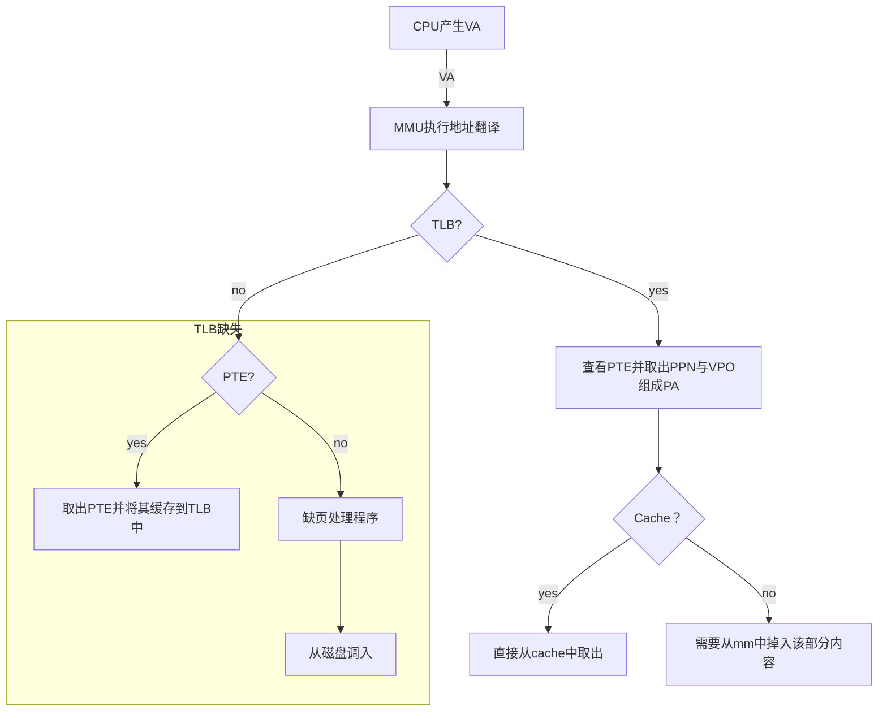

[TOC]

## The Memory Hierarchy(分层)

内存系统最重要的特点就是**利用局部性(locality)**

> [!Important]
>
> 将会学到
>
> - DRAM\SRAM\Disk\SSD
> - Locality

### Storage Technologies

> [!Note]
>
>                  
>
> |                      | DRAM       | SRAM       |
> | -------------------- | ---------- | ---------- |
> | 构成                 | 电容       | 六个晶体管 |
> | 速度                 | 较慢       | 较快       |
> | 价格                 | 较便宜     | 较贵       |
> | 集成度               | 较高       | 较低       |
> | 功耗                 | 低         | 高         |
> | 主要用途             | 主存、显存 | Cache      |
> | 是否采用**定时刷新** | 是         | 否         |
> | 是否地址线服用       | 是         | 否         |
>
> > [!TIp]
> >
> > 1. DRAM和SRAM都是易失性，掉电都会导致存储信息丢失。
> > 2. DRAM为啥要刷新而SRAM为啥不要刷新？
> >    - DRAM使用电容存储，而SRAM用晶体关。电容天然存在**漏电问题**。
> >    - 刷新(refresh):reading it out and the rewriting it.[读出重写]
>
> **DRAM chip**
>
> 
>
> 
>
> RAS request: row access strobe reques 行访问选通请求
>
> CAS request: column access strobe request 列访问选通请求
>
> 对于范围$(i,j)$块，先选择第$i$行，再从第$i$行中选择第$j$个 
>
> DRAM会首先进行RAS，即行选通，然后把这一行写入row buffer(行缓冲区)再进行列访问。
>
> > [!caution]
> >
> > **通过这种方式可以使地址引脚(pins)减半！**
>
> **典型字拓展（并联）**  8M * 8 ----> 8M * 64
>
> 

**Accessing Main Memory**


Example: load

```assembly
movq A, %rax
```


Example :Store

```assembly
movq %rax, A
```


### Disk

#### Disk Geometry


> [!note]
>
> **Surface**磁面，一般来说一个磁盘有一个（两个）磁面，具体看磁盘使得构造。
>
> **Tracks**磁道
>
> **Sectors**扇区，磁盘的读写单位。一般是固定大小常见温彻斯特盘是（512B）
>
> **Gaps**间隔,用以分割一个个扇区，保存有磁盘格式化的形象。
>
> **Cylinder**柱面，同一位置的磁道构成的空间结构
>
> 一般描述磁盘容量用[盘面数/磁道(柱面)数/扇面数]乘在一起在乘以扇面的容量就可以。


一个笔试题：如果每个磁道所含的扇面数相同，则越靠近内部的磁道记录密度越大。

#### Disk 传输时间的计算


- seek time (寻道时间):寻找对应的磁道 由于磁头每次开始移动的位置并不唯一，所以计算seek的时候一般采用平均时间
  - $T_{avgseek}=\frac{T_{maxseek}}{2}$,单位一般是ms

- Rotational Latency(旋转延迟):寻找对应磁道的对应扇区, 由于每次需要旋转的距离是不能确定的，所以一般也采用平均时间(旋转半圈)
  - 一般会告诉磁盘转速，单位rpm(每分钟转多少次)
  - $T_{avgrot}=\frac{60}{n(rmp)}\times\frac{1}{2}\times1000 (ms)$ 单位化成ms
- Data transfer(传输时间)
  - $T_{transfer}=\frac{1}{rpm}\times\frac{1}{average \#sectors/track}\times\frac{60}{1min}$

一般时间只和`seek`与`rotational`有关，`data transfer`一般低于前二者的量级

#### connecting I/O Devices


> [!Important]
>
> **Reading a disk sector**
>
> 


#### SSD (Soild State Disks)


> [!Caution]
>
> Reading from SSDs is **faster** than writing.[读比写快]
>
> 随机读/写比顺序读写慢
>
> 

**Page(页)是读写单位，Block（块）是擦除单位。**

> [!Note]
>
> ​	A page can be written only after the entire block to which it belongs has been erased (已擦除)(typically, this means that all bits in the block are set to 1). However, once a block is erased, each page in the block can be written once with no further erasing.

> [!important]
>
> | **特性**       | **SSD（固态硬盘）**                                       | **HDD（机械硬盘）**                       |
> | -------------- | --------------------------------------------------------- | ----------------------------------------- |
> | **存储介质**   | 闪存芯片（NAND Flash）                                    | 磁性盘片（Spinning Platter）              |
> | **速度**       | **快**：读写速度通常为 500 MB/s ~ 7,000 MB/s（NVMe 更快） | **慢**：读写速度通常为 50 MB/s ~ 150 MB/s |
> | **耐用性**     | **好**：无机械部件，抗震性能强，不易损坏                  | **较差**：机械部件易受震动影响，容易磨损  |
> | **噪音**       | **静音**：无机械运动，无噪音                              | **有噪音**：磁盘旋转与磁头运动会产生声音  |
> | **功耗**       | **低**：更节能，适合便携设备                              | **高**：需要驱动电机，耗电较大            |
> | **容量**       | 容量较小，主流为 256 GB ~ 4 TB                            | 容量大，主流为 1 TB ~ 20 TB               |
> | **价格**       | **贵**：每 GB 成本较高                                    | **便宜**：每 GB 成本较低                  |
> | **寿命**       | **有限写入寿命**：有写入次数限制，但现代 SSD 已大幅改善   | **长寿命**：如果维护得当，可长时间使用    |
> | **体积与重量** | **小巧轻便**：适合轻薄设备                                | **笨重**：体积较大，重量较重              |
> | **碎片影响**   | **无影响**：数据分布不影响速度                            | **明显**：碎片化严重时，性能下降          |
> | **启动时间**   | **快**：几乎瞬间响应                                      | **慢**：需要等待磁盘旋转达到工作状态      |

### Locality (局部性)

**temporal locality and spatial locality**时间局部性与空间局部性


> 时间局部性：在一段时间内，程序倾向于访问同一数据
>
> 空间局部线：在一段时间内，程序倾向于访问与最近访问的数据地址相邻的数据

**Memory Hierarchy(存储层次)**


> [!Important]
>
> **the core of hierarchy**: `cache`
>
> the faster and smaller storage device at level k serves as a cahce for the large and slower storage device at level k + 1
>
> cache都本质是下层都副本(copies)
>
> 


各种各样都Cache


### 重点章节：Cache Memories

#### Cache匹配

图示：二路组相联


> [!Important]
>
> Cache参数列表
>
> 

关键三步走：组选择(set selection)、行匹配(line matching)、字抽取(word extraction)

> 是通过主存地址匹(mm address)配对应的Cache
>
> 组选择：根据Set index选择对应的组
>
> 行匹配：通过在对应都set内比较Tag标签和vaild位是否有效判断Cache是否命中
>
> 若命中则进入字抽取阶段
>
> 根据offest位判断抽取Cache行对应都第几块内容

Chatgpt写的[Cache模拟器](./Cache.html)

**直接映射(direct-mapped)**


> [!Note]
>
> **thrashing(抖动)** 直接映射有个很严重都问题(组相联也有但要好一点)，不同都地址会被映射到同一个Cache行上，可能导致Cache行不停都换入换出。
>
> 例子：
>
> ```c
> float dotprod(float x[8], float y[8]) {
>     float sum = 0. 0;
>     int i = 0;
>     
>     for (i = 0; i < 8; i++)
>         	sum += x[i] * y[i];
>     return sum;
> }
> ```
>
> 
>
> 容易发现每次访问x[i]时会把x对应都block写入cache，但y[i]与x[i]对应都cache行号一致导致每次访问y[i]都会导致x[i]被重写，导致频繁都换入换出。
>
> 解决办法:
>
> 1. 让y[i]与x[i]分别存放在不同都cache行中 (用空间换)
>
> 
>
> 2. 采用全相联(用钱换)

> [!Caution]
>
> 为啥用把set index放在中间，而不是高位呢？
>
> **均匀分布内存地址**，避免局部性导致组冲突。
>
> **利用空间局部性**，提升缓存性能。
>
> **简化硬件实现**，减少复杂性。
>
> **优化标记长度**，节省存储和比较开销。
>
> **保留高位的层次信息**，为地址管理和内存优化提供更好的支持

**Set associative Caches组相联映射**


**Full Associative Caches全相联映射**


#### Cache with writes [Cache的写问题]

写命中(write hit):写直达法(write through)与写回法(write back)

> [!note]
>
> write through:每次更新cache的同时更新mm
>
> write back:每次只在cache被替换算法替换掉的时候把修改内容写入内存
>
> ​	需要额外的dirty bit来保证写回法的正确性

写未命中(write miss):非写分配法(write-no-allocate)与写分配法(write-allocate)

> [!note]
>
> Write-no-allocate 通常和write-through配合使用。未命中的时候同时把内容写入mm与cache副本
>
> write-allocate 通常和write-back配合使用。-->这是较为通用的Cache 模型。

#### 与cache性能相关的参数

- Miss rate. 未命中率
- Hit rate. 命中率
- Hit time. 命中时间，即访问cache的时间，包括组选择、行匹配、字抽取。
- Miss penalty. 未命中代价，即去下一层取得内容的时间。

#### 一些杂七杂八的知识点

分离Cache，现代计算机为了更好的实现流水线一般会采用分离Cache的办法，即把指令Cache(i-cache)与数据Cache(d-cache)分离。同时现代计算机一般独有多级Cache。


## Virtual Memory (虚拟存储)

**Each byte of main memory has a virtual address chosen form the virtual address space and a physical address chosen form the physical address space!**

使用VA的系统和不使用VA系统的区别

         


⚠️：VA-PA (address translation)需要软件(主要是操作系统)与硬件(图中的MMU)共同完成.

VA page <---> PA page 一般采用全相联映射。

> [!note]
>
> 二进制单位后缀
>
> $$KiBi=2^{10}\\MiBi=2^{20}\\GiBi=2^{30}\\TiBi=2^{40}\\PiGi=2^{50}\\EiBi=2^{60}$$

**页表项的三种状态**

- *unallcated* do not hava any data associated with them, and thus do not occupy any space on disk
- *Cached* allocated pages that are currently cached in physical memory
- *Uncached* allocated pages that are not cached in physical memory


只有访问处于 **Cached**状态的页表项可能 **page hit**

> [!important]
>
> **page hits and page faults**
>
> 访问 **Cached**和有效的页表项时未命中，否则发生paga faluts
>
> 
>
> 
>
> 访问已经Uncached的页面导致发生缺页，并且此时物理页框对应的虚拟页已经满了，需要选择一个牺牲页来替换。
>
> (VA系统通常采用LRU策略和write-back& write-no-allocate)
>
> 
>
> ⚠️:选择牺牲页的过程由内核完成，并且由于缺页时异常，执行完缺页处理程序后会返回程序断点处重新执行指令。

**swapped out(paged out)/swapped in(paged in)**

> swapped out(paged out) from disk to DRAM(mm)
>
> swapped in(paged in) from DRAM to disk

**Demand paging(请求调页)**

> waiting until the last moment to swap in a page,when a miss occurs.

**thrashing(抖动)**

> If the working set size exceeds the size of physical memory, then the program can produce an unfortunate situation known as thrashing, where pages are swapped in and out continuously.

### Address translation(地址翻译)


- PTBR(页表基址寄存器) 指向页表(常驻内存的那张页表)
- VPN & VPO : 和起来组成了VA的位数，其中VPO为一页的大小(由于常见页大小为4KB且按字节编址，所以VP O的常见值为log(4k)=12,而VPN=VA-VPO)
- PPN& PPO : 组成了PA的位数，由于页大小和页框大小一般一样大，则VPO=PPO，而PPN则需要通过VPN对应的页表项读出。


**TLB(translation lookaside buffer**

本质为页表项的cache，TLB一般采用较高关联度的映射模式(4-way or 8-way)，TLB使用VPN部分。


### 多级页表

> [!note]
>
> 为啥要引入多级页表，来看一个例子：
>
> 对于64位的机器，如一页大小为4KB，页表项大小为4B。则需要多大的页表呢？
>
> $需要页表项的数目为:2^{64-\log(4k)}=2^{52}\\需要的页表大小为2^{52}\times4B=16PB$
>
> 这个大小的页面需要常驻内存是不可能的，所以需要引入多级页表使得只需要让顶级页表常驻内存即可，其他次级页表之需要在使用的时候调入内存即可。


由于TLB会缓存PTB，所以多级页表并不会特别慢！

### Page and TLB and Cache



> [!Caution]
>
> 发生缺页(page falut)一定意味这TLB和Cache都不可能命中，因为此时需要的页根本不在主存中而是位于磁盘中。
>
> TLB的命中与否和Cache命中与否无关。

